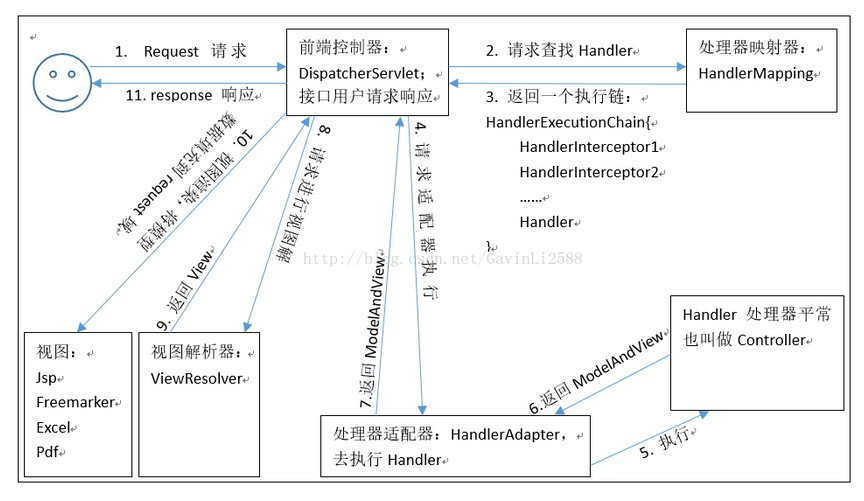

 SpringMVC的入门程序
1. 创建WEB工程，引入开发的jar包
1. 具体的坐标如下
```java
<!-- 版本锁定 -->
···java<properties>
<spring.version>5.0.2.RELEASE</spring.version>
</properties>
<dependencies>
<dependency>
<groupId>org.springframework</groupId>
<artifactId>spring-context</artifactId>
<version>${spring.version}</version>
</dependency>
<dependency>
<groupId>org.springframework</groupId>
<artifactId>spring-web</artifactId>
<version>${spring.version}</version>
</dependency>
<dependency>
<groupId>org.springframework</groupId>
<artifactId>spring-webmvc</artifactId>
<version>${spring.version}</version>
</dependency>
<dependency>
<groupId>javax.servlet</groupId>
<artifactId>servlet-api</artifactId>
<version>2.5</version>
<scope>provided</scope>
</dependency>
<dependency>
<groupId>javax.servlet.jsp</groupId>
<artifactId>jsp-api</artifactId>
<version>2.0</version>
<scope>provided</scope>
</dependency>
</dependencies>
```
2. 配置核心的控制器（配置DispatcherServlet）
1. 在web.xml配置文件中核心控制器DispatcherServlet
```java
<!-- SpringMVC的核心控制器 -->
<servlet>
<servlet-name>dispatcherServlet</servlet-name>
<servlet-class>org.springframework.web.servlet.DispatcherServlet</servletclass>
<!-- 配置Servlet的初始化参数，读取springmvc的配置文件，创建spring容器 -->
<init-param>
3. 编写springmvc.xml的配置文件
4. 编写index.jsp和HelloController控制器类
1. index.jsp
<param-name>contextConfigLocation</param-name>
<param-value>classpath:springmvc.xml</param-value>
</init-param>
<!-- 配置servlet启动时加载对象 -->
<load-on-startup>1</load-on-startup>
</servlet>
<servlet-mapping>
<servlet-name>dispatcherServlet</servlet-name>
<url-pattern>/</url-pattern>
</servlet-mapping>

```
 编写springmvc.xml的配置文件
 ```java
<?xml version="1.0" encoding="UTF-8"?>
<beans xmlns="http://www.springframework.org/schema/beans"
xmlns:mvc="http://www.springframework.org/schema/mvc"
xmlns:context="http://www.springframework.org/schema/context"
xmlns:xsi="http://www.w3.org/2001/XMLSchema-instance"
xsi:schemaLocation="
http://www.springframework.org/schema/beans
http://www.springframework.org/schema/beans/spring-beans.xsd
http://www.springframework.org/schema/mvc
http://www.springframework.org/schema/mvc/spring-mvc.xsd
http://www.springframework.org/schema/context
http://www.springframework.org/schema/context/spring-context.xsd">
<!-- 配置spring创建容器时要扫描的包 -->
<context:component-scan base-package="com.itheima"></context:component-scan>
<!-- 配置视图解析器 -->
<bean id="viewResolver"
class="org.springframework.web.servlet.view.InternalResourceViewResolver">
<property name="prefix" value="/WEB-INF/pages/"></property>
<property name="suffix" value=".jsp"></property>
</bean>
<!-- 设置静态资源不过滤 -->
1. location元素表示webapp目录下的包下的所有文件
2. mapping元素表示以/static开头的所有请求路径，如/static/a 或者/static/a/b

<mvc:resources location="/css/" mapping="/css/**"/> <!-- 样式 -->
<mvc:resources location="/images/" mapping="/images/**"/> <!-- 图片 -->
<mvc:resources location="/js/" mapping="/js/**"/> <!-- javascript -->
<!-- 配置spring开启注解mvc的支持
<mvc:annotation-driven></mvc:annotation-driven>-->
</beans>
```
1. index.jsp
```html
<body>
<h3>入门案例</h3>
<a href="${ pageContext.request.contextPath }/hello">入门案例</a>
</body>


@Controller
       public class HelloController {
       /**
       * 接收请求
       * @return
       */
       @RequestMapping(path="/hello")
       public String sayHello() {
       System.out.println("Hello SpringMVC!!");
       return "success";
       }
       }
```
在WEB-INF目录下创建pages文件夹，编写success.jsp的成功页面
```java
<body>
<h3>入门成功！！</h3>
</body>
```
springmvc中model对象是request级别
##springmvc执行流程

### DispatcherServlet：前端控制器
用户请求到达前端控制器，它就相当于 mvc 模式中的 c，dispatcherServlet 是整个流程控制的中心，由
它调用其它组件处理用户的请求，dispatcherServlet 的存在降低了组件之间的耦合性。
### HandlerMapping：处理器映射器
HandlerMapping 负责根据用户请求找到 Handler 即处理器，SpringMVC 提供了不同的映射器实现不同的
映射方式，例如：配置文件方式，实现接口方式，注解方式等。
### Handler：处理器
它就是我们开发中要编写的具体业务控制器。由 DispatcherServlet 把用户请求转发到 Handler。由
Handler 对具体的用户请求进行处理。
### HandlAdapter：处理器适配器
通过 HandlerAdapter 对处理器进行执行，这是适配器模式的应用，通过扩展适配器可以对更多类型的处理
器进行执行。
### View Resolver：视图解析器
View Resolver 负责将处理结果生成 View 视图，View Resolver 首先根据逻辑视图名解析成物理视图名
即具体的页面地址，再生成 View 视图对象，最后对 View 进行渲染将处理结果通过页面展示给用户。
### View：视图
SpringMVC 框架提供了很多的 View 视图类型的支持，包括：jstlView、freemarkerView、pdfView
等。我们最常用的视图就是 jsp。
一般情况下需要通过页面标签或页面模版技术将模型数据通过页面展示给用户，需要由程序员根据业务需求开
发具体的页面。
### <mvc:annotation-driven>说明
在 SpringMVC 的各个组件中，处理器映射器、处理器适配器、视图解析器称为 SpringMVC 的三大组件。
使 用 <mvc:annotation-driven> 自动加载 RequestMappingHandlerMapping （处理映射器） 和
RequestMappingHandlerAdapter （ 处 理 适 配 器 ） ， 可 用 在 SpringMVC.xml 配 置 文 件 中 使 用
<mvc:annotation-driven>替代注解处理器和适配器的配置。
### ModelAttribute注解
1. 作用
1. 出现在方法上：表示当前方法会在控制器方法执行前线执行。
2. 出现在参数上：获取指定的数据给参数赋值。
2. 应用场景
1. 当提交表单数据不是完整的实体数据时，保证没有提交的字段使用数据库原来的数据。
 - 修饰的方法有返回值
 ```java
/**
* 作用在方法，先执行
* @param name
* @return
*/
@ModelAttribute
public User showUser(String name) {
System.out.println("showUser执行了...");
// 模拟从数据库中查询对象
User user = new User();
user.setName("哈哈");
user.setPassword("123");
user.setMoney(100d);
return user;
}
/**
* 修改用户的方法
* @param cookieValue
* @return
*/
@RequestMapping(path="/updateUser")
public String updateUser(User user) {
System.out.println(user);
return "success";
}

```
 修饰的方法没有返回值
 ```java
/**
* 作用在方法，先执行
* @param name
* @return
*/
@ModelAttribute
public void showUser(String name,Map<String, User> map) {
System.out.println("showUser执行了...");
// 模拟从数据库中查询对象
User user = new User();
user.setName("哈哈");
user.setPassword("123");
user.setMoney(100d);
map.put("abc", user);
}
/**
* 修改用户的方法
* @param cookieValue
* @return
*/
@RequestMapping(path="/updateUser")
public String updateUser(@ModelAttribute(value="abc") User user) {
System.out.println(user);
return "success";
}

```
. SessionAttributes注解
1. 作用：用于多次执行控制器方法间的参数共享
2. 属性
1. value：指定存入属性的名称
3. 代码如下
```java
@Controller
@RequestMapping(path="/user")
@SessionAttributes(value= {"username","password","age"},types=
{String.class,Integer.class}) // 把数据存入到session域对象中
public class HelloController {
/**
* 向session中存入值
* @return
*/
@RequestMapping(path="/save")
public String save(Model model) {
System.out.println("向session域中保存数据");
model.addAttribute("username", "root");
model.addAttribute("password", "123");
model.addAttribute("age", 20);
return "success";
}
/**
* 从session中获取值
* @return
*/
@RequestMapping(path="/find")
public String find(ModelMap modelMap) {
String username = (String) modelMap.get("username");
String password = (String) modelMap.get("password");
Integer age = (Integer) modelMap.get("age");
System.out.println(username + " : "+password +" : "+age);
return "success";
}
/**
* 清除值
* @return
*/
@RequestMapping(path="/delete")
public String delete(SessionStatus status) {
    status.setComplete();
    return "success";
    }
    }
}
```
